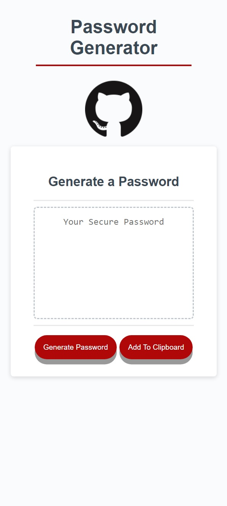

# :zipper_mouth_face::book:A JavaScript Password Generator:book::zipper_mouth_face:

:computer: **Live Deployment:** https://jwilferd10.github.io/JavaScript-Password-Generator/

:computer: **Github Repository:** https://github.com/jwilferd10/JavaScript-Password-Generator

## :open_file_folder: Table of Contents:
  - [Preview](#camera-preview)
  - [Description](#wave-description)
  - [User Story](#book-user-story)
  - [Resources Used](#floppy_disk-resources-used)
  - [Installation](#minidisc-installation-and-usage)
  - [Contact Information](#e-mail-contact-information)

## :camera: Preview:
  

    
    
  

## :wave: Description: 

 
The JavaScript Password Generator is an app that can quickly create a randomized password for all your 🤫 secretive needs! Users will be prompted with multiple questions via window.alert to determine what parameters they would like to include within their password. Users can also copy the generated password onto their clipboard for quick deployment. 

This application works just fine on mobile devices, give it a try and generate a few passwords! Thanks so much for checking this Password Generator out, I hope this helps in anyway possible. Happy Coding! 

  
## :book: User Story:
**AS AN employee with access to sensitive data**
- I WANT to randomly generate a password that meets certain criteria
- SO THAT I can create a strong password that provides greater security

**GIVEN I need a new, secure password**
- WHEN I click the button to generate a password
  - THEN I am presented with a series of prompts for password criteria
- WHEN prompted for password criteria
  - THEN I select which criteria to include in the password
- WHEN prompted for the length of the password
  - THEN I choose a length of at least 8 characters and no more than 128 characters
- WHEN prompted for character types to include in the password
  - THEN I choose lowercase, uppercase, numeric, and/or special characters
- WHEN I answer each prompt
  - THEN my input should be validated and at least one character type should be selected
- WHEN all prompts are answered
  - THEN a password is generated that matches the selected criteria
- WHEN the password is generated
  - THEN the password is either displayed in an alert or written to the page

## :floppy_disk: Resources Used:
Main Resources:
- HTML
- CSS
- JavaScript

## :minidisc: Installation and Usage:
### Install:
- You can do this by clicking the *GREEN* button above and you can download it by ZIP or copy the SSH!
### Usage:
- Click "Generate Password"

Or

- Click on the box with "Your Secure Password"

Then

- Select what to include into password
- Randomly generated password should then appear in center box
- Copy to clipboard by clicking designated button

## :e-mail: Contact Information:
- ### [jwilferd10](https://github.com/jwilferd10)
